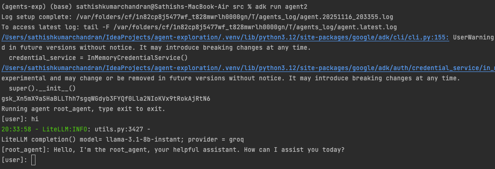
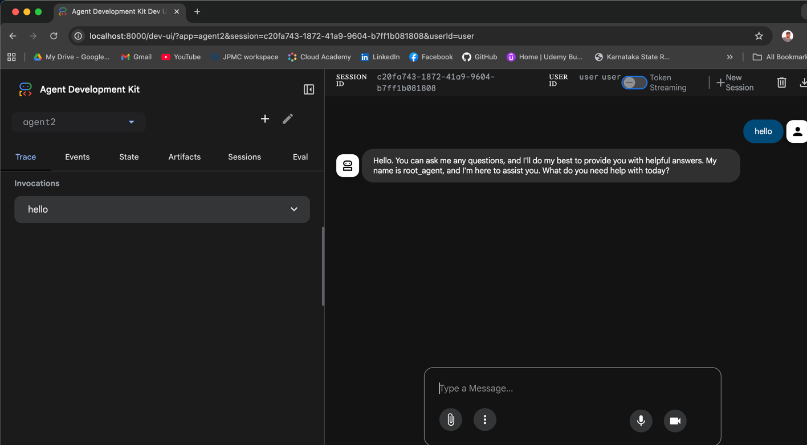

## Agent Exploration
### Google Adk
#### Local setup
    sathishkumarchandran@Sathishs-MacBook-Air agent-exploration % pip install uv
    
    Initialize a uv project
    sathishkumarchandran@Sathishs-MacBook-Air agent-exploration % uv init --lib
    Initialized project `agent-exploration`
    
    To resolve any change in pyproject.toml
    sathishkumarchandran@Sathishs-MacBook-Air agent-exploration % uv sync 
    Resolved 1 package in 28ms
    Built agent-exploration @ file:///Users/sathishkumarchandran/IdeaProjects/agent-exploration
    
    To Add new libraries 
    sathishkumarchandran@Sathishs-MacBook-Air agent-exploration % uv add google-adk
    Resolved 109 packages in 1.86s

#### IDE - Intellij use

#### Project Structure
    
    agent-exploration
        |-.venv ()
        |-src
        |-.env - for local execution
        |-.gitignore
        |-pyproject.toml
        |-Readme.md
        |-uv.lock
        |-.env.example

#### Add agents to the src folder

    (agents-exp) sathishkumarchandran@Sathishs-MacBook-Air src % adk create agent2
    Choose a model for the root agent:
    1. gemini-2.5-flash
    2. Other models (fill later)
    Choose model (1, 2): 2

    Please see below guide to configure other models:
    https://google.github.io/adk-docs/agents/models
    Agent created in /Users/sathishkumarchandran/IdeaProjects/agent-exploration/src/agent2:
     - .env
     - __init__.py
     - agent.py

#### Run adk agent
    (agents-exp) (base) sathishkumarchandran@Sathishs-MacBook-Air src % adk run agent2

    
    (agents-exp) sathishkumarchandran@Sathishs-MacBook-Air agent-exploration % cd src 
    (agents-exp) sathishkumarchandran@Sathishs-MacBook-Air src % adk web
    

        
    http://localhost:8000/docs
    http://localhost:8000/dev-ui

#### Reference
    https://github.com/google/adk-samples/tree/main