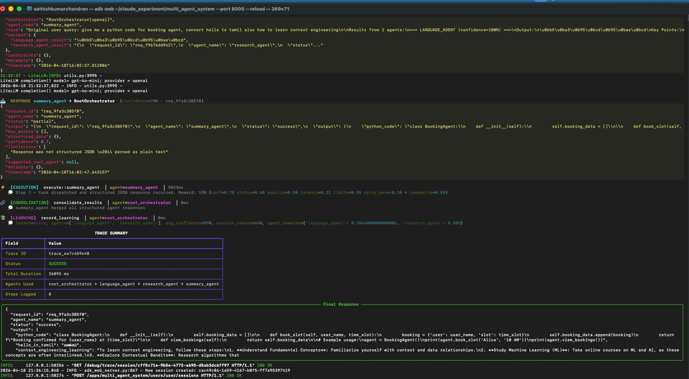

# Google ADK — Custom Multi-Agent System

A production-quality multi-agent system built on **Google Agent Development Kit (ADK) 1.x**.  
Implements a **custom Planner + Coordinator** orchestrator with full trace, context propagation, learning from past executions, **defense-in-depth security at every boundary**, and a **reward engine that scores and improves agent performance automatically**.

---

## System Architecture

```
User Query (AgentInput)
        │
        ▼
┌─────────────────────────────────────────────────────────────────┐
│  SecurityLayer.check_input()   ← prompt injection / PII / rate  │
└────────────────────┬────────────────────────────────────────────┘
                     │
        ▼
┌─────────────────────────────────────────────────────────────────┐
│  RootOrchestrator  [Level 1 — custom BaseAgent]                 │
│                                                                 │
│  ① PLAN      — LLM produces ExecutionPlan (agents + why)       │
│              + RewardEngine.performance_for_prompt() injected   │
│  ② ROUTE     — Logged routing decision with reasoning           │
│  ③ EXECUTE   — SecurityLayer.check_request()                   │
│              → Call agent                                       │
│              → SecurityLayer.check_response()                   │
│              → RewardEngine.score_response()                    │
│              → Auto-retry if reward < 0.45                      │
│  ④ CONSOLIDATE — summary_agent merges all outputs              │
│              → SecurityLayer.check_output()                     │
│  ⑤ LEARN     — Record outcome + reward_score in               │
│                learning_store.json + reward_store.json          │
└────────────────────┬────────────────────────────────────────────┘
                     │ may delegate to ↓
          ┌──────────▼──────────────────────────────────────────┐
          │  DomainOrchestrator [Level 2 — mimics RootOrchestrator] │
          │  (tech domain: research + code + data)               │
          │  Shares SecurityLayer + RewardEngine from Root       │
          └──────┬──────────────┬──────────────┬────────────────┘
                 │              │              │
        ┌────────▼──┐  ┌────────▼──┐  ┌───────▼───┐
        │ research  │  │   code    │  │   data    │
        │  _agent   │  │  _agent   │  │  _agent   │
        │ [Level 3] │  │ [Level 3] │  │ [Level 3] │
        └───────────┘  └───────────┘  └───────────┘

Direct routes from RootOrchestrator:
        ├── language_agent  (translation / content)
        ├── research_agent  (general knowledge, bypass domain orch)
        └── summary_agent   (cross-domain consolidation)
```

---

## Key Design Decisions

### 1. Custom `BaseOrchestrator` (not LlmAgent)

Both `RootOrchestrator` and `DomainOrchestrator` extend `BaseOrchestrator`, which in turn extends ADK's `BaseAgent`. This gives **full programmatic control** over the execution loop — the LLM does not decide which tool to call; the Python code does, after receiving a structured JSON plan from the LLM planner.

```
LlmAgent approach  : LLM decides → calls tool → ADK routes
Custom approach    : Python asks LLM for plan → Python routes → Python consolidates
```

The custom approach enables:
- Deterministic execution order
- Nested orchestration (Domain inside Root)  
- Per-step trace injection
- Learning store integration at every step

### 2. Structured I/O with Pydantic

```python
AgentInput(
    query="...",
    user_id="...",
    context={"key": "value"},   # forwarded to all agents
    metadata={...},
)

AgentOutput(
    response="...",
    status="success",
    agents_used=["domain_orchestrator", "code_agent"],
    trace_id="trace_abc123",
    total_duration_ms=3200.0,
    plan_reasoning="...",
    learning_applied="...",
)
```

### 3. Task Passing via ADK Session State

Each specialist agent's instruction uses **ADK template substitution**:

```python
# Specialist agent instruction
instruction = """
Your task: {code_agent_task}   ← resolved from session state
"""
# Output stored with
output_key = "code_agent_result"   ← written back to session state
```

The orchestrator sets the task before calling the agent:
```python
ctx.session.state["code_agent_task"] = "Write a binary search implementation"
async for event in code_agent.run_async(ctx): ...
result = ctx.session.state["code_agent_result"]
```

### 4. Complete Trace System

Every step emits a `TraceEntry`:

| Step | What it captures |
|------|-----------------|
| `PLANNING` | Full execution plan JSON, LLM reasoning, alternatives considered |
| `ROUTING` | Which agent was chosen, why, confidence score |
| `EXECUTION` | Agent name, task, response, duration, error if any |
| `CONSOLIDATION` | Which results were merged, final output |
| `LEARNING` | What was recorded for future planners |

All trace output is rendered with **Rich** — colored tree view for the plan, per-step icons, and a summary table.

### 5. Learning from Wrong Flows

```
learning_store.json
└── [LearningEntry]
      ├── query_summary    : what was asked
      ├── query_type       : intent classification
      ├── agents_used      : which agents ran
      ├── plan_reasoning   : why the plan was built that way
      ├── success          : true / false
      ├── feedback         : what went wrong (if failed)
      ├── correction       : what should have been done instead
      ├── reward_score     : composite session reward 0.0–1.0 (from RewardEngine)
      ├── session_score    : weighted average across all agents
      └── agent_scores     : {"agent_name": score, ...} per-agent breakdown
```

The **planner prompt** includes the 3-5 most relevant past learnings with reward context:
```
=== PAST LEARNINGS ===
[FAILURE] "translate data analysis to French"
  Agents used  : research_agent, language_agent
  Reward score : 32%
  Agent scores : research_agent=61%, language_agent=28%
  !! CORRECTION: Use data_agent first, THEN language_agent for translation

[SUCCESS] "explain transformers + write attention code"
  Agents used  : domain_orchestrator → research_agent, code_agent
  Reward score : 87%
  Agent scores : research_agent=91%, code_agent=83%
=== END LEARNINGS ===
```

To record a failure manually:
```python
context_manager.record_failure(
    query_summary="...",
    query_type="mixed",
    agents_used=["research_agent"],
    reasoning="thought research alone was enough",
    feedback="needed code example too",
    correction="route to domain_orchestrator for combined research+code",
    reward_score=0.32,
    agent_scores={"research_agent": 0.61},
)
```

### 6. Domain Orchestrator Mimics Root Orchestrator

`DomainOrchestrator` **inherits from `BaseOrchestrator`** — it runs the identical 5-step loop but:
- Its registry only contains tech-domain specialists
- Its planner prompt is scoped to the tech domain  
- It can be invoked directly OR by the Root Orchestrator as `domain_orchestrator`

This means when the Root Orchestrator delegates to it, you see **two nested plan trees** in the trace:
```
🧠 [PLANNING] RootOrchestrator builds plan
  → routes to domain_orchestrator

  🧠 [PLANNING] DomainOrchestrator builds domain plan
    → research_agent: "research transformers"
    → code_agent: "write attention code"
  ⚡ [EXECUTION] research_agent
  ⚡ [EXECUTION] code_agent
  🔗 [CONSOLIDATION] summary_agent

🔗 [CONSOLIDATION] RootOrchestrator summary
```

### 7. Security Layer — Defense at Every Boundary

`SecurityLayer` (`security/security_layer.py`) guards **four boundary points** in every request cycle:

```
User Input ──► [check_input]
                 │
                 ▼
              AgentRequest ──► [check_request]
                                 │
                                 ▼
                              LLM Agent
                                 │
                                 ▼
                              AgentResponse ──► [check_response]
                                                  │
                                                  ▼
                                               Final Text ──► [check_output]
                                                                 │
                                                                 ▼
                                                              Caller
```

**Checks performed at each boundary:**

| Boundary | Checks |
|---|---|
| `check_input` | Rate limiting, max length, prompt injection patterns (14 signatures), shell/SQL/XSS injection, PII redaction |
| `check_request` | Schema completeness, injection in task + context values, PII in task text |
| `check_response` | Harmful output patterns (synthesis/exploit/hacking instructions), secrets leaking in output |
| `check_output` | Max length truncation, harmful content, PII in final response |

**Security signals:**
- `SecurityViolation.severity` : `low` | `medium` | `high` | `critical`
- `SecurityViolation.blocked`  : `True` → request is rejected; `False` → warning only, PII redacted
- All violations logged to `security.get_violation_log()` for audit

**Prompt injection patterns detected:**
```
- "Ignore all previous instructions..."
- "You are now / Act as [persona] without restriction"
- "system prompt:" / system XML tags
- "jailbreak / DAN mode / developer mode"
- "Disregard your safety guidelines"
- Verbatim secret extraction attempts
- Shell: rm -rf, curl, eval(), os.system()
- SQL: UNION SELECT, DROP TABLE, OR 1=1
- XSS: <script>, javascript:, onerror=
```

**PII auto-redacted before any LLM sees it:**
```
[EMAIL]        user@example.com
[PHONE]        +1-555-123-4567
[SSN]          123-45-6789
[CARD]         4111 1111 1111 1111
[API_KEY]      sk-live-xxxxxxxxxxxxxxxxxxxx
[PASSWORD]     password=secret123
[SECRET]       api_key=abc123
[HASH_OR_KEY]  a3f8d9e2b1c4... (32–64 hex chars)
```

**Using SecurityLayer directly:**
```python
from security.security_layer import SecurityLayer

security = SecurityLayer(
    max_input_chars=8000,       # max user query length
    rate_limit_max=30,          # requests per session per minute
    redact_pii=True,            # auto-redact PII in all text
    block_injections=True,      # block prompt injection attempts
    block_malicious_code=True,  # block shell/SQL/XSS patterns
)

result = security.check_input(user_query, session_id="user_123")
if result.has_blocking:
    print("Blocked:", result.summary())
else:
    safe_query = result.sanitized_text or user_query

# View full audit log
for violation in security.get_violation_log():
    print(violation)

# Session rate-limit stats
print(security.session_stats("user_123"))
```

---

### 8. Reward Engine — Performance Scoring and Improvement Loop

`RewardEngine` (`reward/reward_engine.py`) scores every agent execution and feeds performance data back into the system to improve routing decisions over time.

**How scoring works:**

Each `AgentResponse` receives a composite reward score (0.0–1.0) built from five weighted signals:

| Signal | Weight | What it measures |
|---|---|---|
| Confidence | 30% | Raw `response.confidence` from the agent |
| Status | 25% | `success=1.0`, `partial=0.6`, `failed=0.0` |
| Output quality | 25% | Length (≥500 chars = 1.0) + key_points count + structured_data richness |
| Latency | 10% | Penalty for responses slower than 10s |
| Limitations | 10% | Each limitation item reduces score by 0.05 |

Each retry attempt applies an additional −0.05 penalty to discourage unnecessary retries.

**Auto-retry on low reward:**

```
composite_score < 0.45 AND retries < 2
   → refine_task_prompt()  (adds: prior attempt output, limitations, score)
   → re-run agent with refined prompt
   → keep the higher-scoring result
```

**Planner feedback loop:**

After enough executions, `performance_for_prompt()` is injected into every planning LLM call:
```
=== AGENT PERFORMANCE (use to prefer high-reliability agents) ===
  research_agent : avg=87%  recent=91%  runs=23  reliability=high
  code_agent     : avg=82%  recent=85%  runs=18  reliability=high
  data_agent     : avg=64%  recent=70%  runs= 7  reliability=medium
  language_agent : avg=55%  recent=48%  runs= 4  reliability=low
=== END PERFORMANCE ===
```

The planner LLM uses this to prefer high-reliability agents when multiple options could serve a query.

**Learning store integration:**

Every execution now records reward data alongside the routing decision:
```json
{
  "query_summary": "Explain transformers...",
  "query_type": "mixed",
  "agents_used": ["domain_orchestrator", "research_agent"],
  "success": true,
  "reward_score": 0.83,
  "session_score": 0.83,
  "agent_scores": {
    "research_agent": 0.87,
    "code_agent": 0.79
  }
}
```

Future planners see both the routing choice AND how well it performed.

**Using RewardEngine directly:**
```python
from reward.reward_engine import RewardEngine

reward = RewardEngine(persist=True)  # saves to reward_store.json

# Score a response
signal = reward.score_response(
    response=agent_response,
    duration_ms=1840.0,
    trace_id="trace_abc",
    session_id="user_session",
)
print(f"Score: {signal.composite_score:.0%}")
print(f"Breakdown: {signal.reasoning}")

# Check if retry is warranted
if reward.should_retry(signal):
    retry_count = reward.record_retry(signal.request_id)
    refined_task = reward.refine_task_prompt(original_task, signal, agent_response)
    # ... re-run agent with refined_task

# Per-agent performance stats
for agent, stats in reward.get_agent_performance().items():
    print(f"{agent}: avg={stats['avg_score']:.0%} reliability={stats['reliability']}")
```

**Reward store (`reward_store.json`):**

Persistent record of every scored execution — grows with each run. The `RewardEngine` loads this on startup so performance history survives restarts. Excluded from git via `.gitignore`.

---

## File Structure

```
multi_agent_system/
├── main.py                        Entry point + 3 demo queries + interactive mode
├── agent.py                       ADK web UI entry point (exposes root_agent)
├── learning_store.json            Auto-created; grows with each run
├── reward_store.json              Auto-created; per-agent reward records
│
├── models/
│   ├── io_models.py               AgentInput, AgentOutput, AgentTaskResult
│   ├── agent_message.py           AgentRequest, AgentResponse (per-agent boundary contract)
│   └── trace_models.py            TraceEntry, TraceSession, ExecutionPlan, StepType
│
├── security/
│   └── security_layer.py          SecurityLayer — defense-in-depth for all boundaries
│
├── reward/
│   └── reward_engine.py           RewardEngine — scoring, auto-retry, performance tracking
│
├── context/
│   └── context_manager.py         ContextManager + LearningStore (with reward_score field)
│
├── trace/
│   └── tracer.py                  AgentTracer — Rich-rendered trace output
│
├── config/
│   └── llm_config.py              Multi-provider LLM config (OpenAI / Groq / Gemini)
│
└── agents/
    ├── registry.py                AgentRegistry + AgentCapability
    ├── specialist_agents.py       research, code, data, language, summary agents
    ├── base_orchestrator.py       BaseOrchestrator — full 7-step loop
    ├── domain_orchestrator.py     DomainOrchestrator (tech) + build_domain_orchestrator()
    └── root_orchestrator.py       RootOrchestrator + build_root_orchestrator()
```

---

## How Context Flows

```
AgentInput.context
      │
      ▼ injected as user_message prefix
InvocationContext.session.state
      │
      ├── [agent_name]_task      ← set by orchestrator before each agent call
      ├── [agent_name]_result    ← set by agent via output_key
      └── cross-agent context    ← prior results available to subsequent agents
```

Each subsequent agent in the plan can see the results of prior agents via `ctx.session.state`:
```python
# code_agent can reference research results
instruction = """
Prior research context: {research_agent_result}
Your task: {code_agent_task}
"""
```

---

## Running the System

### Option A — ADK Web UI (recommended for testing)

The fastest way to test — gives you a full chat interface in the browser.

#### 1. Install dependencies

```bash
/Users/sathishkumarchandran/anaconda3/bin/pip install -r \
  /Users/sathishkumarchandran/claude_experiment/multi_agent_system/multi_agent_system/requirements.txt
```

#### 2. Add your API key to `.env`

```
LLM_PROVIDER=openai
OPENAI_API_KEY=sk-...
```

#### 3. Launch ADK web server

```bash
/Users/sathishkumarchandran/anaconda3/bin/adk web \
  /Users/sathishkumarchandran/claude_experiment/multi_agent_system \
  --port 8000 \
  --reload
```

#### 4. Open browser

```
http://localhost:8000
```

- Select **multi_agent_system** from the dropdown
- Type any query in the chat box
- Watch the trace in the terminal + the response in the browser

#### Auto-reload during development

The `--reload` flag restarts the server whenever you edit any `.py` file — no need to restart manually.

#### Run on a different port

```bash
/Users/sathishkumarchandran/anaconda3/bin/adk web \
  /Users/sathishkumarchandran/claude_experiment/multi_agent_system \
  --port 9000
```

---

### Option B — ADK API Server (headless / REST)

Exposes the agent as a REST API you can call with `curl` or Postman.

```bash
/Users/sathishkumarchandran/anaconda3/bin/adk api_server \
  /Users/sathishkumarchandran/claude_experiment/multi_agent_system \
  --port 8001
```

Then call it:

```bash
# 1. Create a session
curl -X POST http://localhost:8001/apps/multi_agent_system/users/user1/sessions \
  -H "Content-Type: application/json" \
  -d '{}'

# 2. Send a query (replace SESSION_ID with the id from step 1)
curl -X POST \
  "http://localhost:8001/apps/multi_agent_system/users/user1/sessions/SESSION_ID/run" \
  -H "Content-Type: application/json" \
  -d '{
    "new_message": {
      "role": "user",
      "parts": [{"text": "Write a Python quicksort"}]
    }
  }'
```

---

### Option C — Python script (main.py)

### Step 1 — Install dependencies

```bash
cd /Users/sathishkumarchandran/claude_experiment/multi_agent_system/multi_agent_system

/Users/sathishkumarchandran/anaconda3/bin/pip install \
  "google-adk[extensions]>=1.0.0" \
  google-genai>=1.0.0 \
  openai>=1.0.0 \
  litellm>=1.0.0 \
  pydantic>=2.0.0 \
  python-dotenv>=1.0.0 \
  rich>=13.0.0
```

Or via requirements.txt:

```bash
/Users/sathishkumarchandran/anaconda3/bin/pip install -r requirements.txt
```

---

### Step 2 — Configure your LLM provider

Copy the example env file:

```bash
cp .env.example .env
```

Then open `.env` and fill in **one** of these blocks:

**OpenAI**
```
LLM_PROVIDER=openai
OPENAI_API_KEY=sk-xxxxxxxxxxxxxxxxxxxxxxxx
```

**Groq** (free tier — get key at [console.groq.com](https://console.groq.com))
```
LLM_PROVIDER=groq
GROQ_API_KEY=gsk_xxxxxxxxxxxxxxxxxxxxxxxx
```

**Gemini** (get key at [aistudio.google.com](https://aistudio.google.com))
```
LLM_PROVIDER=gemini
GOOGLE_API_KEY=AIzaxxxxxxxxxxxxxxxxxxxxxxxx
```

---

### Step 3 — Verify setup (run tests first)

```bash
/Users/sathishkumarchandran/anaconda3/bin/python3 test_system.py
```

Expected output:
```
  PASS  config      ← .env loaded, API key found
  PASS  llm         ← direct LLM call succeeded
  PASS  agent       ← research_agent ran end-to-end
  PASS  pipeline    ← full RootOrchestrator → agents → trace worked

  4/4 tests passed
✓ System ready — run: python main.py
```

If any test fails it prints the exact fix needed.

---

### Step 4 — Run the app

```bash
/Users/sathishkumarchandran/anaconda3/bin/python3 main.py
```

This runs **3 built-in demo queries** showing the full trace, then enters **interactive mode**.

---

### Step 5 — Interactive mode: what to type

Try these queries to exercise different routing paths:

```
# Triggers: domain_orchestrator → code_agent
Write a Python function for binary search

# Triggers: domain_orchestrator → research_agent + code_agent
Explain LSTM networks and show a PyTorch example

# Triggers: language_agent (direct)
Translate "machine learning" to Spanish, French, and Japanese

# Triggers: domain_orchestrator → data_agent
What patterns should I look for in e-commerce conversion rate data?

# Triggers: domain_orchestrator → research_agent + code_agent + data_agent (all 3)
Explain time-series anomaly detection, write Python code for it,
and describe what data patterns indicate anomalies
```

Type `quit` or press `Ctrl+C` to exit.

---

### Run a Single Query Programmatically

```python
# save as my_query.py, run with:
# /Users/sathishkumarchandran/anaconda3/bin/python3 my_query.py

import asyncio, sys
sys.path.insert(0, '.')

from main import build_system, run_query
from models.io_models import AgentInput

async def main():
    runner, ctx_mgr, tracer, session_svc = build_system()

    result = await run_query(
        AgentInput(
            query="Explain quicksort and write it in Python",
            user_id="my_user",
            context={"expertise_level": "intermediate"},
        ),
        runner, session_svc, tracer,
    )

    print(result.summary())       # structured one-liner
    print(result.response)        # full LLM response
    print("Agents:", result.agents_used)
    print("Trace ID:", result.trace_id)

asyncio.run(main())
```

---

### Understanding the trace output

| Symbol | Step | What it shows |
|--------|------|---------------|
| `📋` | PLANNING | Full JSON execution plan — agents chosen + WHY + performance hints |
| `🔀` | ROUTING | Which agent was selected, confidence score |
| `⚡` | EXECUTION | Agent running — input task, response preview, reward score, duration |
| `🔗` | CONSOLIDATION | Results from all agents being merged |
| `📚` | LEARNING | Outcome + reward scores saved to `learning_store.json` |
| `❌` | ERROR | Security block or agent failure with reason |

Security events appear as `❌ [ERROR] security_block::agent_name` with the violation detail.  
Reward scores appear inline with each execution step: `Reward: 87% (conf=0.90 status=1.00 quality=0.82 ...)`.  
Auto-retry appears as `⚡ [EXECUTION] retry::code_agent::1` when a low-score response is re-run.

After each run, `learning_store.json` accumulates past decisions **with reward scores**. The next query's planner reads these and adjusts routing to avoid past mistakes and prefer high-performing agents.

---

## Extending the System

### Add a New Specialist Agent

```python
# agents/specialist_agents.py
def build_my_agent() -> LlmAgent:
    return LlmAgent(
        name="my_agent",
        model="gemini-2.0-flash",
        output_key="my_agent_result",
        instruction="Your task: {my_agent_task}\n...",
    )
```

### Add It to a Domain Orchestrator

```python
# agents/domain_orchestrator.py — inside build_domain_orchestrator()
my_agent = build_my_agent()
registry.register(my_agent, AgentCapability(
    name="my_agent",
    description="...",
    domain="tech",
    capabilities=["..."],
    input_types=["..."],
    output_types=["..."],
))
orchestrator.specialist_agent_names.append("my_agent")
```

### Create a New Domain Orchestrator

```python
class FinanceOrchestrator(BaseOrchestrator):
    pass

def build_finance_orchestrator(ctx_mgr, tracer):
    registry = AgentRegistry()
    # register finance-specific agents
    return FinanceOrchestrator(
        name="finance_orchestrator",
        domain="finance",
        specialist_agent_names=[...],
        registry=registry,
        context_manager=ctx_mgr,
        tracer=tracer,
        genai_client=genai.Client(),
    )
```

Then register it with the RootOrchestrator — it becomes a peer of `domain_orchestrator`.

---

## Trace Output Example

```
▶  TRACE SESSION STARTED
   Trace ID : trace_abc123def
   Query    : Explain transformers and write Python attention code

📋 EXECUTION PLAN
   ├─ Understanding : User wants explanation + code example for transformer attention
   ├─ Intent        : mixed (tech research + code generation)
   ├─ Agents        : domain_orchestrator
   ├─ Steps
   │    └─ domain_orchestrator — delegate full tech query
   │         Why: query requires both research and code; domain_orchestrator handles both
   └─ Alternatives  : research_agent alone (insufficient — no code)
   └─ Performance   : research_agent avg=87% (high), code_agent avg=82% (high)

🔀 [ROUTING]    route_to::domain_orchestrator │ agent=root_orchestrator │ 2ms
   💭 Query needs research + code; domain_orchestrator plans internally

   📋 EXECUTION PLAN  [DomainOrchestrator]
   ...

📤 REQUEST  DomainOrchestrator → research_agent  (step 1 · req_3a7f...)
   { "task": "Research transformer architecture...", "context": {} }

   ⚡ [EXECUTION]  execute::research_agent  │ agent=research_agent  │ 1843ms
   💭 Step 1 — Reward: 87% (conf=0.90 status=1.00 quality=0.82 latency=0.95)

📤 REQUEST  DomainOrchestrator → code_agent  (step 2 · req_9b2c...)
   { "task": "Write Python attention...", "context": {"research_agent_result": "..."} }

   ⚡ [EXECUTION]  execute::code_agent  │ agent=code_agent  │ 2210ms
   💭 Step 2 — Reward: 79% (conf=0.85 status=1.00 quality=0.71 latency=0.88)

   🔗 [CONSOLIDATION] consolidate_results  │ agent=domain_orchestrator │ 1120ms

🔗 [CONSOLIDATION] consolidate_results     │ agent=root_orchestrator   │ 980ms
📚 [LEARNING]      record_learning         │ agent=root_orchestrator   │ 0ms
   💭 Intent=mixed, agents=[research_agent, code_agent], session_reward=83%,
      agent_rewards={research_agent: 87%, code_agent: 79%}

┌─ TRACE SUMMARY ─────────────────────────────┐
│ Trace ID  │ trace_abc123def                  │
│ Status    │ SUCCESS                          │
│ Duration  │ 6890 ms                          │
│ Agents    │ domain_orchestrator → research   │
│           │ → code_agent → summary           │
│ Steps     │ 10                               │
└─────────────────────────────────────────────┘
```

### Security block example

```
❌ [ERROR]  security_block::code_agent  │ agent=root_orchestrator  │ 0ms
   💭 SecurityLayer blocked request: CRITICAL:prompt_injection:ignore_instructions
   ✖  [SECURITY BLOCKED] Request blocked: CRITICAL:prompt_injection:ignore_instructions
```

### Auto-retry example

```
⚡ [EXECUTION]  execute::code_agent           │ agent=code_agent  │ 4100ms
   💭 Step 2 — Reward: 38% (conf=0.50 status=0.60 quality=0.22 ...)

⚡ [EXECUTION]  retry::code_agent::1          │ agent=code_agent  │ 0ms
   💭 Low reward score: 38% — retrying with refined prompt (attempt 1)

⚡ [EXECUTION]  execute::code_agent           │ agent=code_agent  │ 3800ms
   💭 Step 2 (retry 1) — Reward: 74% — kept retry result (74% > 38%)
```

## Execution

