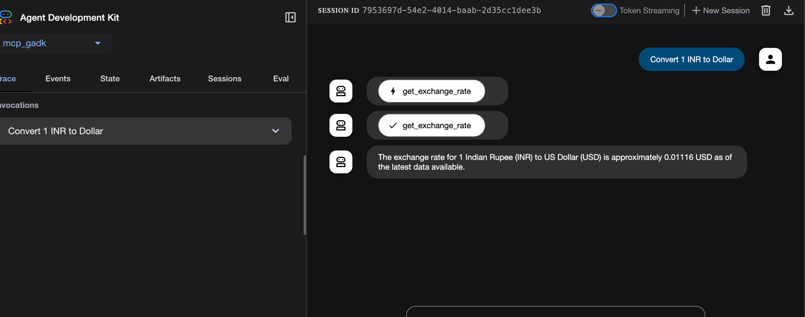

### FastMCP server & Google Adk
    sathishkumarchandran@Sathishs-MacBook-Air mcp_gadk % fastmcp run mcp_server.py:mcp --transport http --port 8001
    (agents-exp) sathishkumarchandran@Sathishs-MacBook-Air src % adk web

### Calling MCP from google adk 

### Reference

* https://codelabs.developers.google.com/codelabs/currency-agent#3